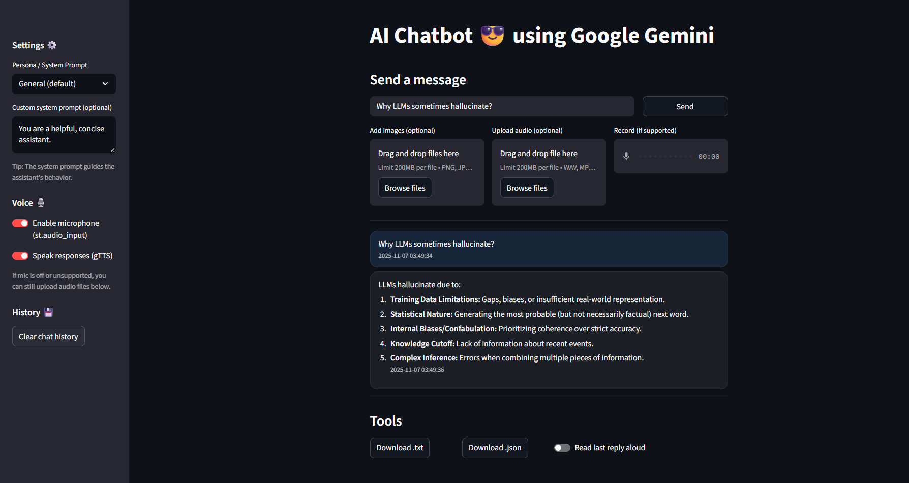

# 🌌 Gemini StreamChat

> **Author:** Jay Govind Kumar  



---

### ✨ Overview
**Gemini StreamChat** is an advanced AI chatbot built with **Streamlit** and **Google Gemini Generative AI**.  
It provides a modern chat interface with support for text, image, and voice input, customizable personas, real-time text-to-speech output, and persistent chat history — all wrapped in a clean dark-themed UI.

---

### 🚀 Features

| Category | Description |
|-----------|-------------|
| 💬 **Conversational AI** | Generates intelligent, context-aware replies using Google Gemini models |
| 🧠 **Multiple Personas** | Switch between system prompts (Tutor, Interviewer, Writer, etc.) |
| 🖼️ **Vision Support** | Upload images for multimodal responses |
| 🎙️ **Voice Input & Output** | Record microphone audio or upload files; listen via gTTS speech |
| 🧾 **Chat History** | View, clear, and download your conversation (.txt / .json) |
| 🧰 **Streamlit UI** | Fast interactive front-end with dark-mode styling |
| 🔒 **Secure API Key** | Uses environment variable, not hard-coded key |

---

### 🧩 Tech Stack
- **Frontend:** Streamlit  
- **Backend Model:** Google Gemini Flash (`gemini-flash-latest`)  
- **Language:** Python 3.10+  
- **Libraries:** `google-generativeai`, `streamlit`, `gTTS`, `pydub`

---

### ⚙️ Installation & Setup

```bash
# Clone repository
git clone https://github.com/YOUR_USERNAME/Gemini-StreamChat.git
cd Gemini-StreamChat

# (Optional) create virtual environment
python -m venv .venv
.\.venv\Scripts\Activate

# Install dependencies
pip install -r requirements.txt
# or
pip install streamlit google-generativeai gTTS pydub
